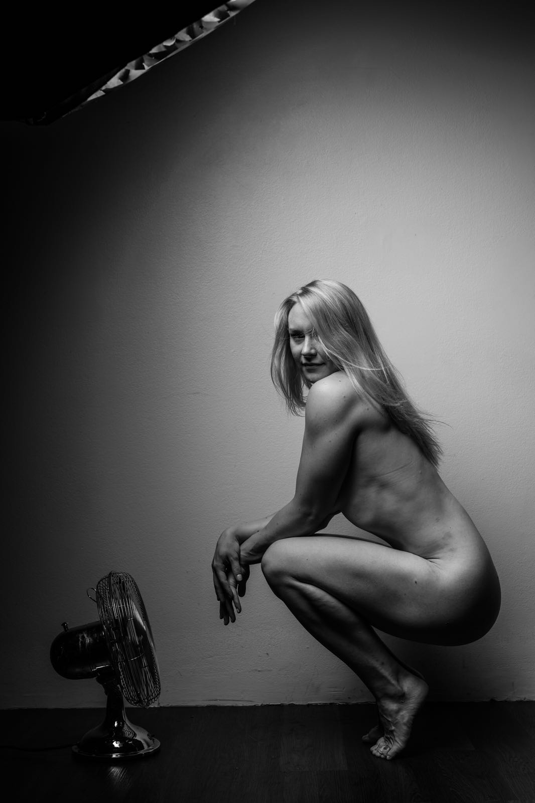

	

		
	

	
Specializing in aerial hoop, training actively handstands and dancing

		

		  TRAINING
		  Aerial acrobatics 2011 -> 
		  Handstands 2011 ->
		  Dancehall (queen style) and twerk 2017 ->
		  Pole dancing 2009 - 2012
		 
		  TEACHING
		  Currently teaching (mostly) aerial hoop classes at <a href="https://www.verticalclub.fi/">Vertical Club</a>, occasionally also pole dancing, handstands and hammock tricks. Private lessons are possible.
		 
		  SHOW HIGHLIGHTS
		<li> <i>Body Good</i>, aerial hoop, Circus Helsinki Open Stage, 2018</li>
		<li> <i>Bad news</i>, aerial rope, The Emma Insley Circus Night, Letterkenny Ireland, 2016</li>
		<li> <i>No man's prize</i>, aerial hoop, Vertical club chrismas party, 2016</li>
		

	

	

			
			photo by Pete Voutilainen
	

	

